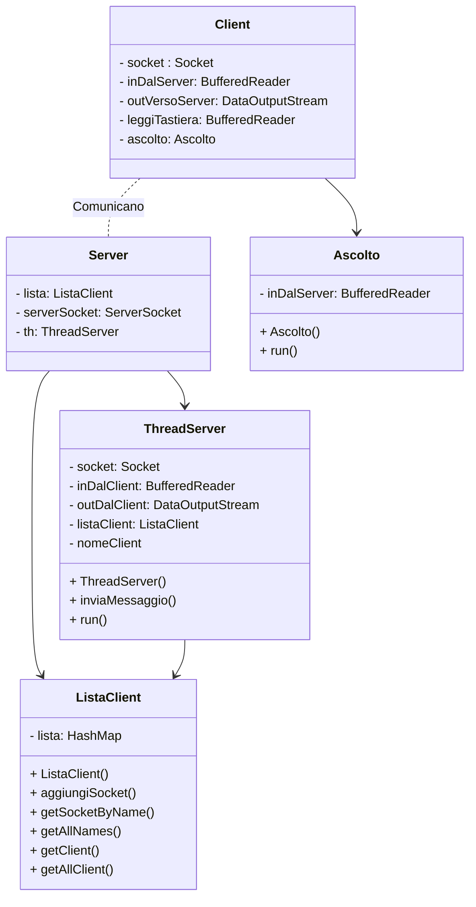

#A school project

### Componenti del gruppo
- Riccardo Grandi
- Swaran Singh
- Ardi Ndreu

# Chat 

Realizzazione di una chat client-server.

## Indice

* [Il funzionamento](#funzionamento)
* [Casi d'uso del client](#casiClient)
* [Casi d'uso del server](#casiServer)
* [Il protocollo](#protocollo)
* [Diagramma delle classi](#diagramma)

## <a id="funzionamento" /> Il funzionamento

La nostra chat funziona in questo modo: 
1. il client, dopo la connessione al server, deve inviare come prima informazione il proprio nome;  
2. il client, dopo aver inviato il nome, può inviare messaggi ad un singolo destinatario oppure a tutti (no gruppi); 
3. il server può inoltrare i messaggi agli altri client (singolo o tutti);  
4. il client gestisce attraverso un messaggio speciale la chiusura della connessione verso il server.

## <a id="casiClient" /> Casi d'uso del client

Il client viene utilizzato per scambiare messaggi con gli altri client.

> **Nota:** se il client si è connesso per la prima volta deve inviare obbligatoriamente il proprio nome al server altrimenti non può inviare messaggi agli altri client.

## <a id="casiServer" /> Casi d'uso del server

Il server viene utilizzato per gestire la comunicazione tra i client connessi.

>  **Nota:** il server è in grado di gestire eventuali errori o situazioni inattesse come per esempio se il client inserisce il nome di un client insistente.

##  <a id="protocollo" /> Il protocollo

Ecco il protocollo che abbiamo utilizzato:

|Client                         |Server                         		|
|-------------------------------|---------------------------------------|
|`@ALL`						   	|"Invio il messaggio a tutti"			|
|`C`						   	|"Ecco tutti i client collegati"		|
|`nome`        					|"Ti ho registrato"   					|
|`nome di un altro client`      |"Dimmi il messaggio che devo inviargli"|
|`messaggio`      				|"Invio il messagio al 'nomeClient'"	|
|`Q`      						|"Chiudo connessione"					|
|`NULL` (per non inviare niente)|										|

## <a id="diagramma" /> Diagramma delle Classi

Ecco il diagramma uml delle classi della nostra chat:

